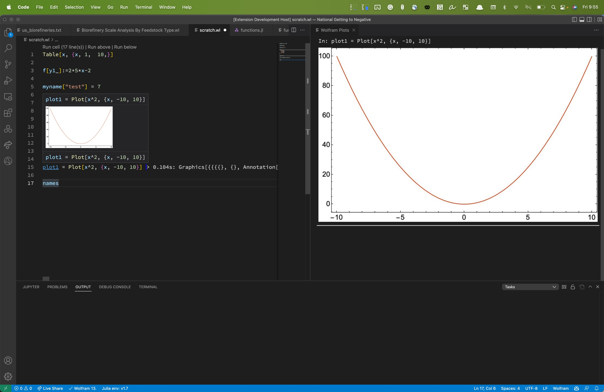

# WLSP

This is an implementation of the [Language Server Protocol](https://github.com/Microsoft/language-server-protocol) for the Wolfram language[1].

## Installation
The language server requires an installation of [Wolfram](https://www.wolfram.com) or the [Wolfram Engine](https://www.wolfram.com/engine/) with wolframscript.

The wolframscript path can be configured.

## Features
Kernel: Evaluate wolfram code blocks, selections, and files

Results: Preview results in the plot window and on hover

Hovers: supports function documentation and variable previews on hover

Signatures: supports function signatures 

Folding Ranges: supports folding ranges for functions

Document Formatting: supports document formatting by request

Completions: supports variable and function completions. Partial support for association keys included

Document Symbols: supports finding symbol references and implementations

Code Lens: provides code lens to run sections (split by 3 lines)

Rename: partial support for renaming expressions

Definitions: provides definitions for most built-in functions and function preview for custom functions

Colors: provides a color picker for the RGBA function

Workspace Symbols: provides support for finding symbols in a workspace 

## Other features
### Run Expressions

### Print Results to Document

### Show Image Output

### Auto Completion, Function Signature, Hover

### Find Help

### Notebooks

## License 
This project is made available under the MIT License

## Acknowledgments 
[kenkangxgwe] (https://github.com/kenkangxgwe/lsp-wl)

[codeparser] (https://github.com/WolframResearch/codeparser)

[1] Wolfram is a registered trademark of Wolfram Research, Inc. All other product names mentioned are trademarks of their producers.
